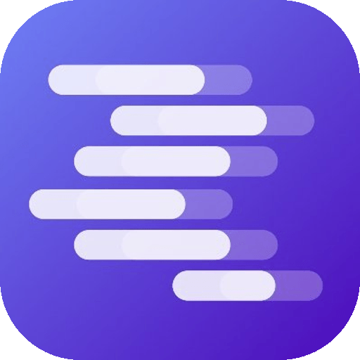

<div align="center">



# LM Link for Android

**A free, open-source Android client for [LM Studio](https://lmstudio.ai)**

Chat with models on your Mac or PC over Wi‑Fi, or run GGUF models on-device with [llama.cpp](https://github.com/ggerganov/llama.cpp) via [llama.rn](https://github.com/mybigday/llama.rn).

<br />

[](LICENSE)
[](https://expo.dev)
[](#using-the-app)
[](#contributing--issues)

<br />

[Report a bug](https://github.com/Dead-Stone/lm-link/issues/new) · [Request a feature](https://github.com/Dead-Stone/lm-link/issues/new) · [Contributing](CONTRIBUTING.md) · [Security](SECURITY.md)

<br />

<sub>Independent project — not affiliated with, endorsed by, or sponsored by LM Studio or Element Labs Inc.</sub>

</div>

---

## Table of contents

- [What it does](#what-it-does)
- [Screenshots](#screenshots)
- [Using the app](#using-the-app)
- [Development](#development)
- [Repository layout](#repository-layout)
- [Contributing & issues](#contributing--issues)
- [Legal](#legal)
- [License](#license)

---

## What it does

| Mode | Description |
|------|-------------|
| **Remote** | Stream chat from LM Studio on your computer (same Wi‑Fi). Models load on the Mac/PC; your phone is the client. |
| **On-device** | Download GGUF models in the Model Library and run them locally (requires a native build, not Expo Go). |

**Highlights**

- Streaming chat with live token speed and usage stats  
- Unified model library — discover, search, and download for Mac/PC and phone  
- Local network scan to find LM Studio on your LAN  
- Vision attachments for capable remote models  
- Conversation history stored on device  
- Interactive setup guide and first-launch tutorial  

---

## Screenshots

*Screenshots coming soon — PRs welcome.*

---

## Using the app

### Requirements

- Android device  
- [LM Studio](https://lmstudio.ai) 0.4+ on Mac, Windows, or Linux (for remote chat)  
- Phone and computer on the same Wi‑Fi (for discovery and local inference)

### Quick setup

1. **On your computer** — Load a model in LM Studio → **Developer** → enable **Serve on Local Network** + **CORS** → **Start Server**. Note the URL (e.g. `http://192.168.1.5:1234/v1`).
2. **On your phone** — **Settings → Connection** → scan the network or paste the URL → **Test** → **Save**.
3. Open a chat and pick a model from the footer picker.

The in-app **Setup Guide** and **tutorial** walk through each step with illustrations.

### Download

- **Install guide** — [dead-stone.github.io/lm-link/install.html](https://dead-stone.github.io/lm-link/install.html)  
- **Production** — Google Play (`com.lmlink.android`) — *rolling out*  
- **Pre-production APK** — [GitHub Releases](https://github.com/Dead-Stone/lm-link/releases/latest) (preview builds for testers; upload from `builds/` after `npm run build:apk:local`)  
- **Build from source** — see [Development](#development) below  

---

## Development

### Prerequisites

- Node 18+  
- Android Studio / SDK (for native builds and on-device models)  
- [LM Studio](https://lmstudio.ai) (to test remote connections)

### Clone and run

```bash
git clone https://github.com/Dead-Stone/lm-link.git
cd lm-link
npm install   # runs patch-package (patches/)
npx expo start
```

| Goal | Command |
|------|---------|
| Quick UI test (remote chat only) | Expo Go — scan QR from `expo start` |
| Full app + on-device models | `npm run android` |
| Preview APK (local) | `npm run build:apk:local` → `builds/` |
| Production AAB (local) | `npm run build:aab:local` → `builds/` |
| Production AAB (EAS cloud) | `npm run build:aab` |

Patches under [`patches/`](patches/) are applied automatically on `npm install`. The opening hero (`assets/hero-animation.gif`) can be regenerated from `assets/lm-studio-logo.png` + `assets/android-head-tutorial.json` with `npm run compose-readme-hero` (requires [gifsicle](https://www.lcdf.org/gifsicle/): `brew install gifsicle`). See [CONTRIBUTING.md](CONTRIBUTING.md) for code style and PR workflow.

### Tech stack

Expo SDK 54 · React Native · expo-router · llama.rn · AsyncStorage · expo-secure-store · FlashList

---

## Repository layout

```
lm-link/
├── app/                 # Screens (expo-router) — chat, settings, onboarding, tutorial
├── components/          # UI — model picker, library, chat, setup guide, tutorials
├── lib/                 # App logic — API, storage, local models, connection, search
├── assets/              # Icons, Lottie, brand images
├── docs/                # Privacy policy, third-party notices
├── patches/             # patch-package overrides for Expo tooling
├── plugins/             # Expo config plugins (e.g. local network on Android)
├── scripts/             # Build helpers, icon compose, llama.rn install
├── app.config.ts        # Expo app config
├── eas.json             # EAS Build profiles
└── CONTRIBUTING.md      # How to contribute
```

**Good starting points in the codebase**

| Area | Path |
|------|------|
| LM Studio API & network scan | [`lib/api.ts`](lib/api.ts) |
| Chat streaming & messages | [`app/chat/[id].tsx`](app/chat/%5Bid%5D.tsx), [`lib/chat-request.ts`](lib/chat-request.ts) |
| On-device models (GGUF) | [`lib/local-models.ts`](lib/local-models.ts) |
| Model library UI | [`components/ModelLibraryModal.tsx`](components/ModelLibraryModal.tsx) |
| Connection settings | [`app/settings.tsx`](app/settings.tsx), [`lib/connection-string.ts`](lib/connection-string.ts) |
| Setup guide copy | [`lib/setup-guide.ts`](lib/setup-guide.ts) |

---

## Contributing & issues

We welcome bug reports, feature ideas, and pull requests.

1. **Search [existing issues](https://github.com/Dead-Stone/lm-link/issues)** first.  
2. **Open a new issue** with steps to reproduce (bugs) or a clear description (features).  
3. **Fork → branch → PR** — see [CONTRIBUTING.md](CONTRIBUTING.md). Run `npx tsc --noEmit` before submitting.

**Security vulnerabilities** — please report privately; see [SECURITY.md](SECURITY.md). Do not open a public issue for undisclosed security problems.

Maintainer: [Mohana Moganti](mailto:mohanmoganti2023@gmail.com)

---

## Legal

| Document | Link |
|----------|------|
| Privacy policy | [docs/PRIVACY.md](docs/PRIVACY.md) |
| Third-party notices | [docs/THIRD_PARTY_NOTICES.md](docs/THIRD_PARTY_NOTICES.md) |
| Security policy | [SECURITY.md](SECURITY.md) |

In the app: **About → Privacy Policy** and **Open Source Licenses**.

---

## License

[MIT](LICENSE) — Copyright © 2025–2026 Mohana Moganti.

Bundled libraries and downloaded model weights are subject to their own licenses — see [docs/THIRD_PARTY_NOTICES.md](docs/THIRD_PARTY_NOTICES.md).
